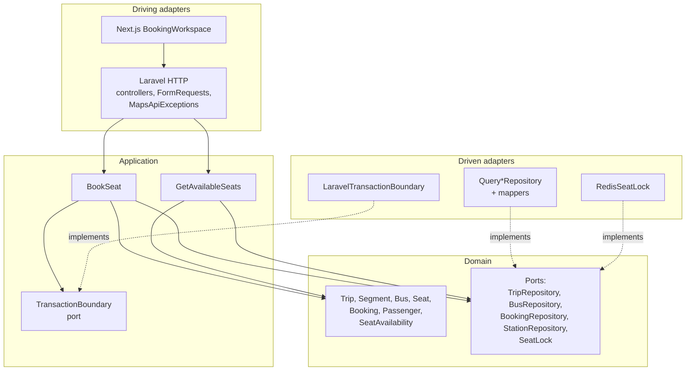
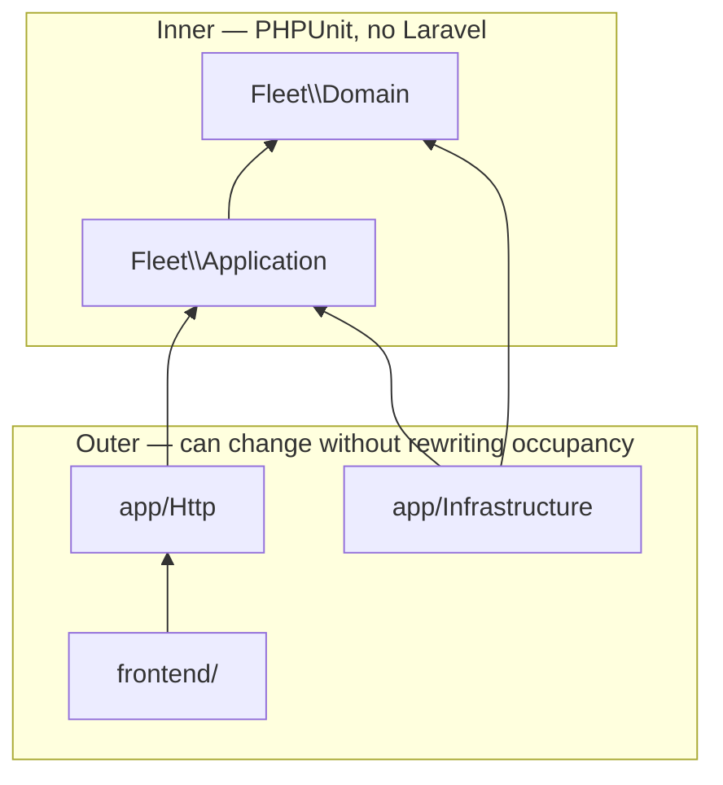
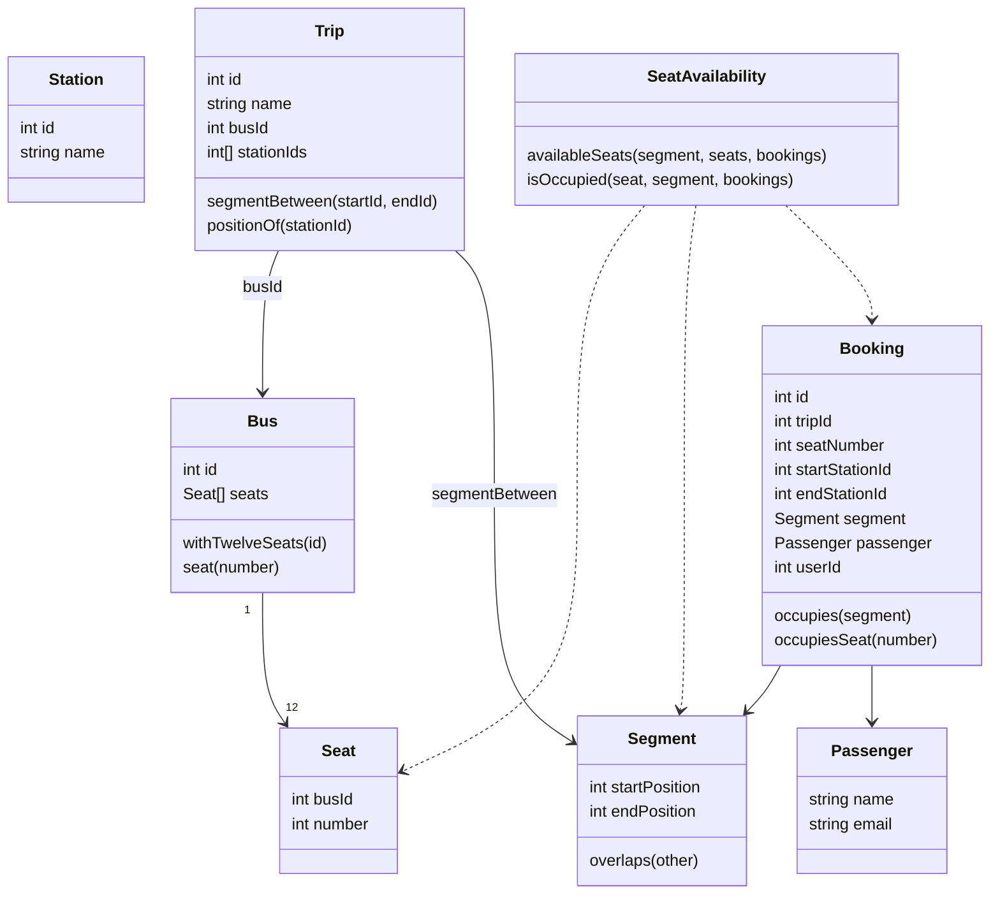
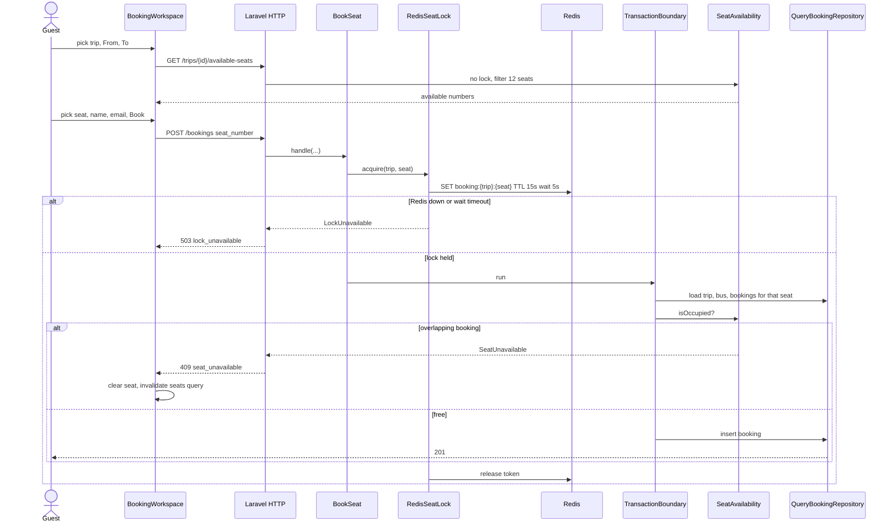

# Fleet

Golyv senior full-stack assessment: Egypt city bus booking. Laravel 13 API + Next.js 16.3.3. Postgres for this run; the schema and lock ports stay MySQL-switchable.

Two guests book the same seat at the same instant. Redis holds `booking:{trip}:{seat}` so one write commits; the other waits, sees the occupied segment, and the UI shows **409**, clears the selection, and refreshes availability.


| Path | Role |
|---|---|
| `backend/` | Laravel 13 API (PHP 8.4), domain in `src/` |
| `frontend/` | Next.js 16.3.3 App Router |
| `docker-compose.yml` | Postgres 16, Redis 7, PHP-FPM, Nginx, web |
| `compose.env.example` | Service DNS names and host ports |
| `backend/.env.example` | Laravel / PHP-FPM |
| `frontend/.env.example` | Next.js |

## Run

Host PHP is required because `backend/` (including `vendor/`) is bind-mounted into `api`. Skip host `npm install` — Alpine native addons will not load from a macOS `node_modules`. The `web` image runs `npm ci`; named volumes keep those Linux modules and `.next`.

```bash
cp compose.env.example compose.env
cp backend/.env.example backend/.env
cp frontend/.env.example frontend/.env
cd backend && composer install && cd ..
docker compose --env-file compose.env up --build
```

Leave `APP_KEY` empty. The API entrypoint generates one, writes it into `backend/.env`, and reuses it on later starts. It then migrates and seeds if the catalog is empty.

| File | Owns |
|---|---|
| `compose.env` | DNS names (`postgres`, `api`, …) and host ports |
| `backend/.env` | App key, database, Redis, session, cache |
| `frontend/.env` | `NEXT_PUBLIC_API_URL` |

If you change `NGINX_PORT`, update `APP_URL` and `NEXT_PUBLIC_API_URL` to match. Postgres user/password in Compose must match `DB_*` in `backend/.env`.

PHP edits on the host show up without rebuilding. Rebuild the image when the Dockerfile or PHP extensions change.

```bash
docker compose --env-file compose.env up -d --build api
docker compose --env-file compose.env down
docker compose --env-file compose.env down -v   # drop Postgres data too
```

## URLs

- API: http://localhost:8000/api/v1
- **Swagger UI:** http://localhost:8000/docs
- OpenAPI YAML: http://localhost:8000/docs/openapi.yaml
- Web: http://localhost:3000 — guest booking; optional sign-in
- Postgres / Redis: ports from `compose.env`

## API

Guest booking is the primary path. Optional Sanctum Bearer on `POST /bookings` stamps `user_id`.

| Method | Path | Auth |
|---|---|---|
| GET | `/api/v1/trips` | public |
| GET | `/api/v1/trips/{id}` | public |
| GET | `/api/v1/trips/{id}/available-seats?start_station_id=&end_station_id=` | public |
| POST | `/api/v1/bookings` | optional Bearer |
| POST | `/api/v1/register` | public |
| POST | `/api/v1/login` | public |
| GET | `/api/v1/me` | Bearer |

Envelope: `{ "data": ... }` or `{ "error": { "code", "message", "details?" } }`. Try the flows in Swagger rather than copying curl from here.

Seeded catalog: Cairo → Fayyum → Minya → Asyut (trip 1) and a second trip via Giza. Seat 5 on trip 1 is booked Cairo→Minya and Minya→Asyut (adjacent handover, no overlap).

## Architecture

Laravel is the host, not the model. Catalog and occupancy live in `backend/src` (`Fleet\Domain`, `Fleet\Application`). HTTP, Redis, and SQL sit outside that core and are swapped at the composition root (`AppServiceProvider`). Domain tests boot PHPUnit only — no container, no Eloquent.

Decisions that matter in review live in [`adr/`](adr/README.md):

- [0001](adr/0001-redis-seat-lock.md) — Redis lock `booking:{trip}:{seat}`; fail closed (`503`) if Redis is down. Not a session store (`SESSION_DRIVER=file`), not an availability cache.
- [0002](adr/0002-half-open-segments.md) — a booking occupies `[start, end)`. Adjacent handover does not overlap.
- [0003](adr/0003-query-builder-for-fleet-tables.md) — query builder + mappers for fleet tables. `User` stays Eloquent for Sanctum, outside the fleet hexagon.

### Hexagonal architecture

Driving adapters call inward. Driven adapters implement ports the domain declared. Nothing in `Fleet\Domain` imports `App\` or `Illuminate\`.



`User` / Sanctum stay Laravel-shaped: register, login, `/me`, and an optional Bearer on `POST /bookings` that stamps `user_id`. Guest booking does not go through that model.

### Optional sign-in

Guest booking is the default. The header can sign in or create an account against `POST /login` and `POST /register`.

The Sanctum access token lives in a **Zustand store in memory**. It is not written to `localStorage`, `sessionStorage`, or a cookie. Refresh, a new tab, or Sign out drops it. While it is present, `POST /bookings` sends `Authorization: Bearer` and the API stamps `user_id`.

That is a deliberate assessment tradeoff, not a vault. XSS on the page can still read the token from JS. A production SPA with a separate API would use a BFF: short-lived access token in memory, **httpOnly refresh cookie**, silent rotate. The Laravel API still issues a long-lived PAT; we did not add refresh tokens or Next.js auth routes.

Seeded account (after first Compose seed): `test@example.com` / `password`.

### Dependency direction

Dependencies point inward only. The domain does not know Postgres, Redis, or HTTP. Application orchestrates domain objects through ports. Infrastructure depends on those ports — never the other way around.



Composer encodes the split: `Fleet\Domain\` → `src/Domain/`, `Fleet\Application\` → `src/Application/`, `App\` → `app/`. Bindings in `AppServiceProvider` are the only place adapters are chosen:

| Port | Adapter |
|---|---|
| `TripRepository` | `QueryTripRepository` |
| `BusRepository` | `QueryBusRepository` |
| `BookingRepository` | `QueryBookingRepository` |
| `StationRepository` | `QueryStationRepository` |
| `SeatLock` | `RedisSeatLock` |
| `TransactionBoundary` | `LaravelTransactionBoundary` |

Switching the runtime to MySQL changes the connection, not `SeatAvailability` or `BookSeat`.

### DDD components

One bounded context: a trip is an ordered list of stations on **one** bus. There is no Route aggregate, no timetable, no `seats` table. Seat identity is `(busId, number)` 1–12. Occupancy is a domain service over already-loaded bookings, not an ORM callback.



`Segment` is half-open `[start, end)`. Overlap is `a < d && c < b`, so Cairo→Minya and Minya→Asyut can share seat 5. Station ids **and** positions are stored on the booking row so a later route edit cannot rewrite history.

### Booking flow

The UI is a driving adapter. Availability may be slightly stale; the lock + occupancy re-read is what prevents a double book. `GetAvailableSeats` does not take the lock.



Two guests, same seat, same instant: Redis serializes the writers. The first commits. The second acquires the lock, re-reads occupancy, and gets `409` — not a second row. The UI shows the API message, clears the selected seat, and refetches availability. No success toast on conflict.

## Production notes

This Compose stack is for the assessment, not a deploy.

- Frontend: bind `./frontend` but keep `node_modules` and `.next` in named Linux volumes. Do not `npm install` on macOS into that bind — native addons will not load in Alpine. Rebuild `web` when the Dockerfile or Node version changes.
- API: the whole `backend/` tree is bind-mounted. Rebuild `api` only for the PHP image or extensions. Opcache revalidates timestamps.
- Redis is a single instance. Production would add persistence and failover and still fail closed without a lock.
- No payments, cancel/expire, waitlists, admin CRUD, or multi-bus trips.

## Tests

PHPUnit (no Pest). Domain tests do not boot Laravel.

```bash
cd backend
php artisan test
php artisan test --testsuite=Domain
php artisan test tests/Feature/Api
php artisan test --coverage
php artisan test tests/Feature/Booking/RedisSeatLockTest.php
```

CI runs PHPUnit with coverage on `app/` and `src/` (no floor). Feature tests boot from committed `backend/.env.testing` (sqlite / array cache) so GitHub Actions does not need a developer `.env`. Local: `composer test:coverage`.

The Redis lock test skips if Redis is not reachable on `127.0.0.1`. With Compose up, map `REDIS_HOST` for that one case or run it against the published Redis port.

```bash
cd frontend
npm test
npm run test:coverage
```

Coverage writes `frontend/coverage/lcov.info`. CI fails if statements, branches, functions, or lines drop below **75%**. In Cursor: Testing sidebar → **Run Tests with Coverage**, or open the HTML report at `frontend/coverage/index.html`. With Compose:

```bash
docker compose exec web npm run test:coverage
```
