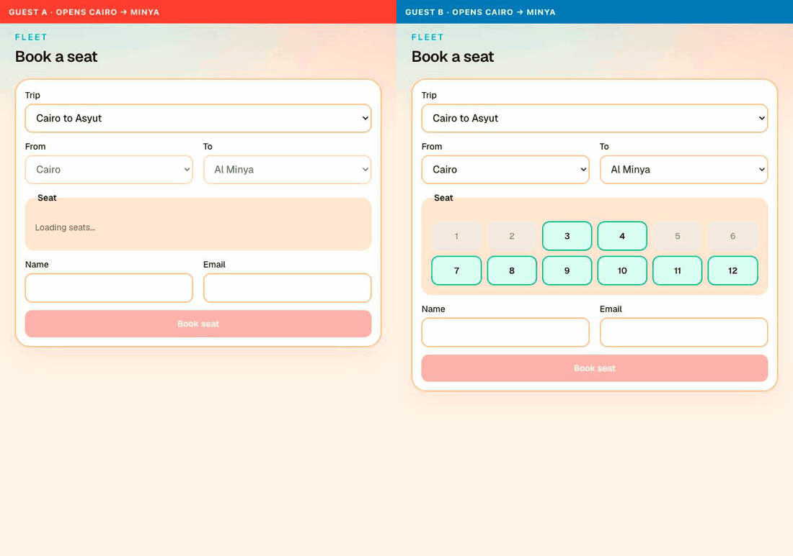

# Fleet

Golyv senior full-stack assessment: book a seat on an Egypt city bus without a double book.

If we only have a few minutes, start with the race. Two guests submit the same seat at the same instant. Redis holds `booking:{trip}:{seat}` across the write. One request commits. The other waits, re-reads occupancy, and the UI shows **409**, clears the seat, and refreshes availability.



Reproduce it after Compose is up: open http://localhost:3000 in two windows, pick the same trip and segment, and book the same free seat. Seat 5 on trip 1 is already taken Cairo→Minya and free again from Minya onward.

## Architecture decisions

Diagrams and the hexagon live in [ARCHITECTURE.md](ARCHITECTURE.md). These records are the choices that are easy to defend in review. Status is **accepted** unless noted.

| # | Decision |
|---|---|
| [0001](adr/0001-redis-seat-lock.md) | Redis serializes booking writes; Postgres stays portable |
| [0002](adr/0002-half-open-segments.md) | A booking occupies `[start, end)` |
| [0003](adr/0003-query-builder-for-fleet-tables.md) | Query builder + mappers for fleet tables, not Eloquent |

## Run

```bash
cp compose.env.example compose.env
cp backend/.env.example backend/.env
cp frontend/.env.example frontend/.env
docker compose --env-file compose.env up --build
```

Leave `APP_KEY` empty. The API entrypoint writes one into `backend/.env`, then migrates and seeds when the catalog is empty.

- Web: http://localhost:3000 — guest is the primary path; optional sign-in is `test@example.com` / `password`
- Swagger: http://localhost:8000/docs
- API: http://localhost:8000/api/v1

If you change `NGINX_PORT`, update `APP_URL` and `NEXT_PUBLIC_API_URL`. Compose Postgres credentials must match `backend/.env`.

```bash
docker compose --env-file compose.env down
docker compose --env-file compose.env down -v
```

## API

Envelope is `{ "data" }` or `{ "error": { "code", "message", "details?" } }`. Optional Bearer on `POST /bookings` stamps `user_id`. Guest booking does not require an account.

| Method | Path | Auth |
|---|---|---|
| GET | `/api/v1/trips` | public |
| GET | `/api/v1/trips/{id}` | public |
| GET | `/api/v1/trips/{id}/available-seats?start_station_id=&end_station_id=` | public |
| POST | `/api/v1/bookings` | optional Bearer |
| POST | `/api/v1/register` | public |
| POST | `/api/v1/login` | public |
| GET | `/api/v1/me` | Bearer |

## Tests

The whole PHPUnit suite (Domain, Unit, Feature) with the same coverage the IDE shows — **96.5%** on `app/` and `src/`. CI fails the backend job under **85%**.

```bash
cd backend && php artisan test --coverage
```

```bash
cd frontend && npm run test:coverage
```
