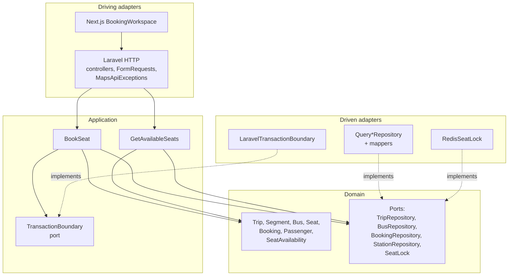
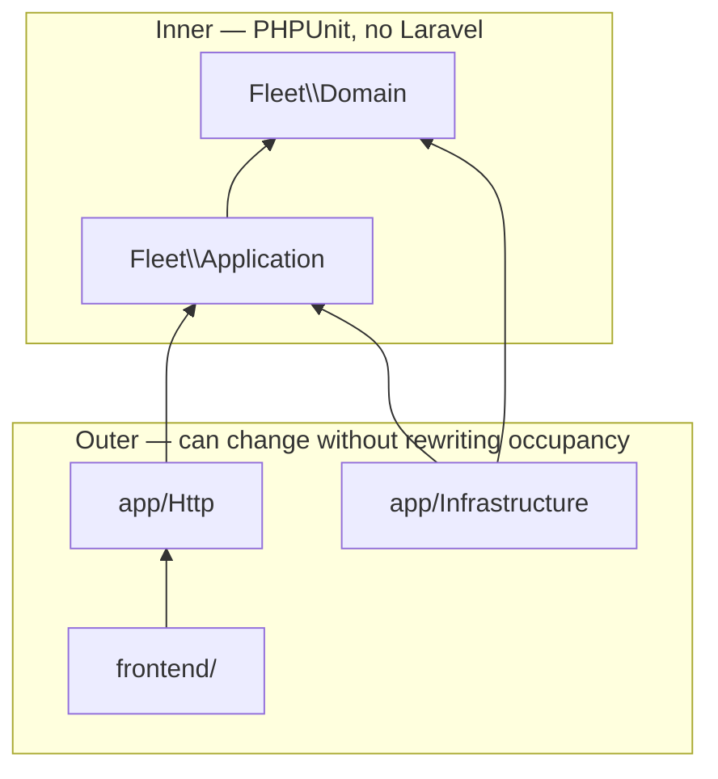
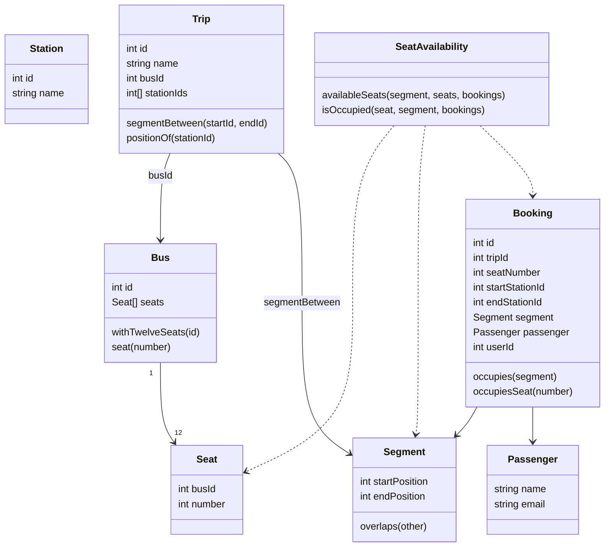
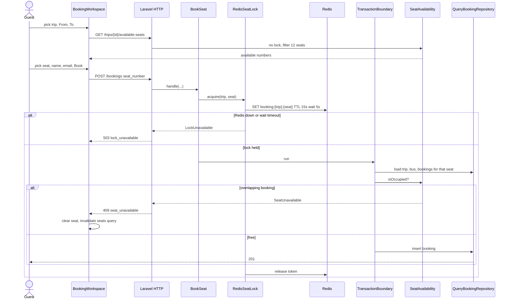

# Architecture

This is the review brief. The working plan is [PLAN.md](PLAN.md). Laravel is the host, not the model. Occupancy lives in `backend/src` (`Fleet\Domain`, `Fleet\Application`). HTTP, Redis, and SQL sit outside that core and are bound in `AppServiceProvider`. Domain tests boot PHPUnit only — no container, no Eloquent.

If we walk the code, start at `BookSeat` and `SeatAvailability`, then the Redis lock, then the HTTP envelope. The three decisions I will defend:

- [0001](adr/0001-redis-seat-lock.md) — Redis lock `booking:{trip}:{seat}`; fail closed (`503`) if Redis is down. Not a session store (`SESSION_DRIVER=file`), not an availability cache.
- [0002](adr/0002-half-open-segments.md) — a booking occupies `[start, end)`. Adjacent handover does not overlap.
- [0003](adr/0003-query-builder-for-fleet-tables.md) — query builder + mappers for fleet tables. `User` stays Eloquent for Sanctum, outside the fleet hexagon.

## Hexagonal architecture

Driving adapters call inward. Driven adapters implement ports the domain declared. Nothing in `Fleet\Domain` imports `App\` or `Illuminate\`.

`User` / Sanctum stay Laravel-shaped: register, login, `/me`, and an optional Bearer on `POST /bookings` that stamps `user_id`. Guest booking does not go through that model.

## Optional sign-in

Guest booking is what the assessment asked for. Sign-in is extra: the header hits `POST /login` and `POST /register`.

The Sanctum access token lives in a Zustand store in memory. It is not written to `localStorage`, `sessionStorage`, or a cookie. Refresh, a new tab, or Sign out drops it. While it is present, `POST /bookings` sends `Authorization: Bearer` and the API stamps `user_id`.

That is a deliberate assessment tradeoff, not a vault. XSS on the page can still read the token from JS. A production SPA with a separate API would use a BFF: short-lived access token in memory, httpOnly refresh cookie, silent rotate. The Laravel API still issues a long-lived PAT; this repo does not add refresh tokens or Next.js auth routes.

Seeded account (after first Compose seed): `test@example.com` / `password`.

## Dependency direction

Dependencies point inward only. The domain does not know Postgres, Redis, or HTTP. Application orchestrates domain objects through ports. Infrastructure depends on those ports — never the other way around.

Composer encodes the split: `Fleet\Domain\` → `src/Domain/`, `Fleet\Application\` → `src/Application/`, `App\` → `app/`. Bindings in `AppServiceProvider` are the only place adapters are chosen:

| Port | Adapter |
|---|---|
| `TripRepository` | `QueryTripRepository` |
| `BusRepository` | `QueryBusRepository` |
| `BookingRepository` | `QueryBookingRepository` |
| `StationRepository` | `QueryStationRepository` |
| `SeatLock` | `RedisSeatLock` |
| `TransactionBoundary` | `LaravelTransactionBoundary` |

Switching the runtime to MySQL changes the connection, not `SeatAvailability` or `BookSeat`.

## Domain

One bounded context: a trip is an ordered list of stations on **one** bus. There is no Route aggregate, no timetable, no `seats` table. Seat identity is `(busId, number)` 1–12. Occupancy is a domain service over already-loaded bookings, not an ORM callback.

`Segment` is half-open `[start, end)`. Overlap is `a < d && c < b`, so Cairo→Minya and Minya→Asyut can share seat 5. Station ids **and** positions are stored on the booking row so a later route edit cannot rewrite history.

## Booking flow

This is the path in the README gif. The UI is a driving adapter. Availability may be slightly stale; the lock + occupancy re-read is what prevents a double book. `GetAvailableSeats` does not take the lock.

Two guests, same seat, same instant: Redis serializes the writers. The first commits. The second acquires the lock, re-reads occupancy, and gets `409` — not a second row. The UI shows the API message, clears the selected seat, and refetches availability.
