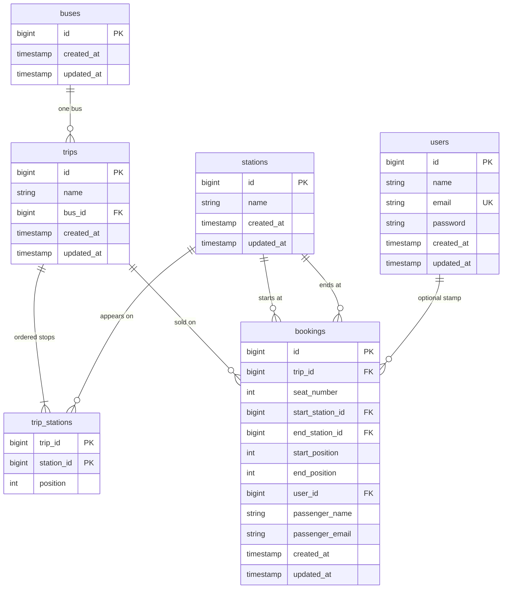
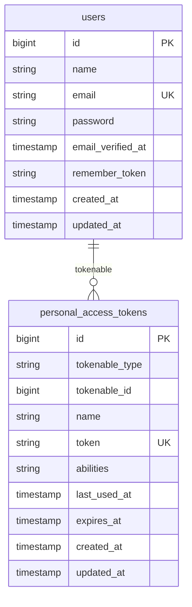

# Database ERD

Schema source: `backend/database/migrations/2026_09_01_12000*_create_*.php`. Runtime is Postgres; types stay MySQL-switchable. Occupancy is **not** a unique `(trip, seat)` and **not** an `EXCLUDE` constraint. [0002](adr/0002-half-open-segments.md) and [0003](adr/0003-query-builder-for-fleet-tables.md).

**Not tables:** seats 1–12 live on the bus in the domain (`Bus::withTwelveSeats`). The booking row stores `seat_number`. Redis key `booking:{tripId}:{seatNumber}` is the write mutex, not a row. [0001](adr/0001-redis-seat-lock.md).

## Fleet catalog and bookings

`trip_stations.position` is unique **per trip** (`UNIQUE (trip_id, position)`). The drawn `UK` is that pair, not a global unique position. Primary key is `(trip_id, station_id)`.

`bookings.user_id` is nullable. Guest rows leave it null. `ON DELETE SET NULL` if the user is removed. Passenger name and email are always snapshotted on the row.

`bookings` has an index on `(trip_id, seat_number)` so `BookSeat` can reload that seat. It is **not** unique: Cairo→Minya and Minya→Asyut may both use seat 5.

Station ids **and** positions are stored on the booking so a later edit of `trip_stations` cannot rewrite a sold segment.

Delete rules: trip → bus and booking → trip/station are `RESTRICT`. Removing a trip drops its `trip_stations` (`CASCADE`).

## Laravel auth (not the occupancy model)

`User` is Eloquent because Sanctum expects it. Guest booking does not require a row here.

`password_reset_tokens` and `sessions` exist from the Laravel stub. This app uses `SESSION_DRIVER=file` (Compose) / `array` (PHPUnit). Redis is not a session store. Cache and jobs tables are unused by booking.

## Seeded shape

After Compose seed: stations Cairo=1 … Asyut=5. Trip 1 is Cairo → Fayyum → Minya → Asyut (skips Giza) on bus 1. Trip 2 includes Giza on bus 2. Seat 5 on trip 1 is already booked Cairo→Minya (`start_position=0`, `end_position=2`) and free from Minya onward.
