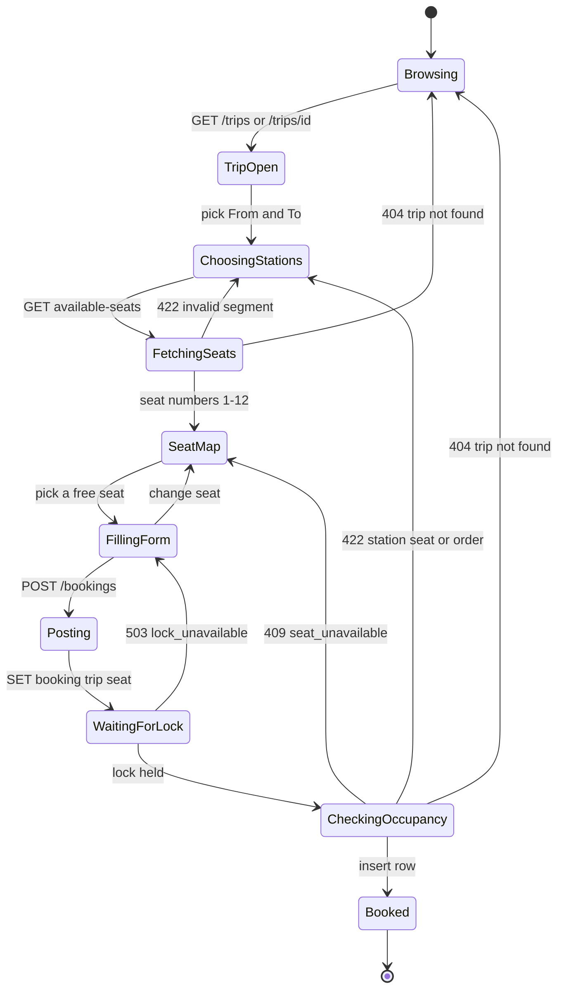
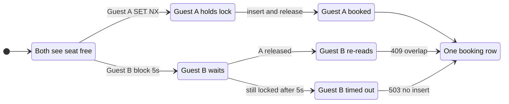

# Booking state

End-to-end machine for one guest. The UI is a driving adapter. `GET .../available-seats` does not take the Redis lock, so **Seat map** can be slightly stale. The lock plus a second occupancy read on `POST /bookings` is what prevents a double book.

Bookings are immediate and **immutable**. There is no cancel, no hold-that-expires, no paid/unpaid. A successful insert is the terminal sold state.

## One guest

Happy path is top to bottom. Failures return to an earlier choice; they do not leave a booking row.

| State | What is true |
|---|---|
| Browsing | Catalog only. No lock. |
| TripOpen | Trip + ordered stations loaded. |
| ChoosingStations | From/To must be on that trip, From before To. |
| FetchingSeats | Domain filter over existing bookings. May be stale. |
| SeatMap | Twelve numbers minus overlapping occupancy. |
| FillingForm | Name + email. Optional Bearer stamps `user_id`. |
| Posting | Request accepted by HTTP. Outcome not decided. |
| WaitingForLock | Redis `booking:{trip}:{seat}`, TTL 15s, wait 5s. |
| CheckingOccupancy | DB transaction. Re-read that seat. `SeatAvailability`. |
| Booked | Row inserted. Lock released. No further transitions. |

**409** clears the selected seat and refetches the map. **503** keeps the form: Redis was down or another writer held the key for 5s. Booking without the lock is a race, so the API fails closed.

Optional sign-in (`/login`, `/register`, `/me`) sits beside this machine. It does not change occupancy. A Bearer on `POST /bookings` only stamps `user_id`.

## Two guests, same seat

This is the README race. Both can sit on **Seat map** at once. Redis allows only one writer into **CheckingOccupancy**.

The loser does not get a second row. Adjacent handover (Cairo→Minya then Minya→Asyut on the same seat) is **not** this machine: after A books, B’s re-read sees no overlap and B also reaches **Booked**.
